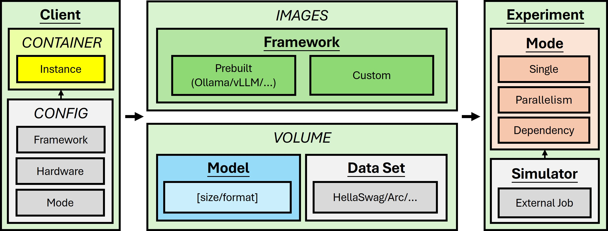

# llm-expr-platform

This repository provides an infrastructure automation script for managing Docker environments and running simulation experiments for LLM-related frameworks.

<div align="center">
  
</div>


## Prerequisites

- Docker must be installed and running on your system.
- Python 3 must be installed to run the launcher script.


## Usage

### Download (Optional)

#### 1️⃣ Update the Configuration JSON File
Edit the `json/download_config.json` file to specify the resources you want to fetch.

#### 2️⃣ Run the following command to automatically download all resources defined in your configuration
```
./run.sh --download
```

### Docker

#### 1️⃣ Update the Configuration JSON File
Edit the `json/docker_config.json` file to specify your settings.

#### 2️⃣ Build the Docker Image
```
./run.sh --docker build
```

#### 3️⃣ Run the Docker Container
- Runs the specified serving command from `config.json` in the background
```
./run.sh --docker run
```

#### 4️⃣ Execute into the Docker Container
- Opens an interactive shell inside the running containe
```
./run.sh --docker exec
```